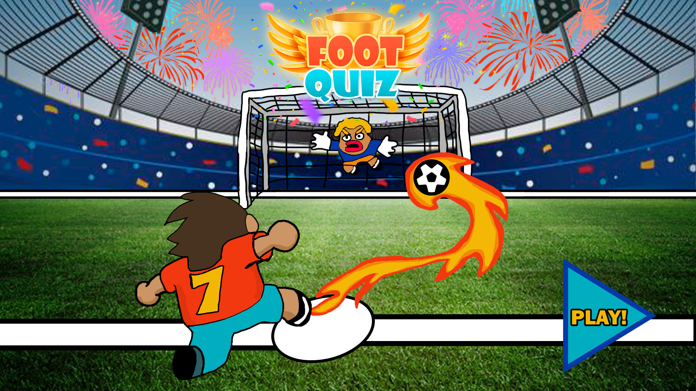
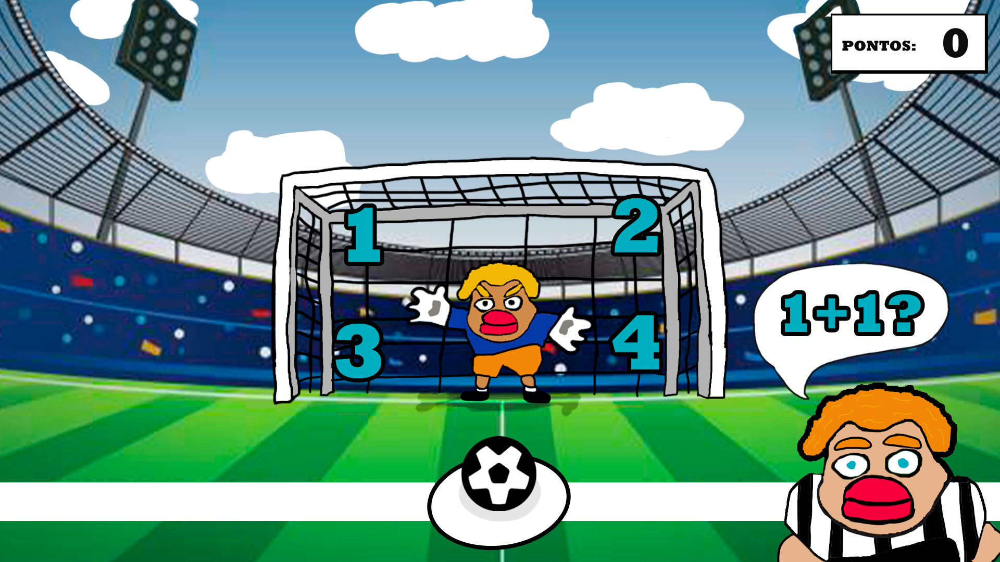
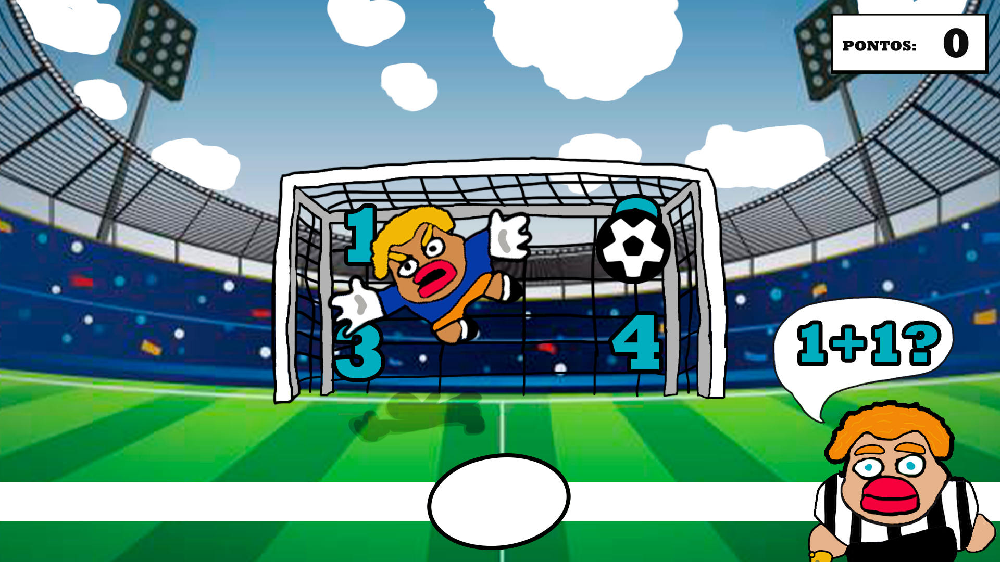
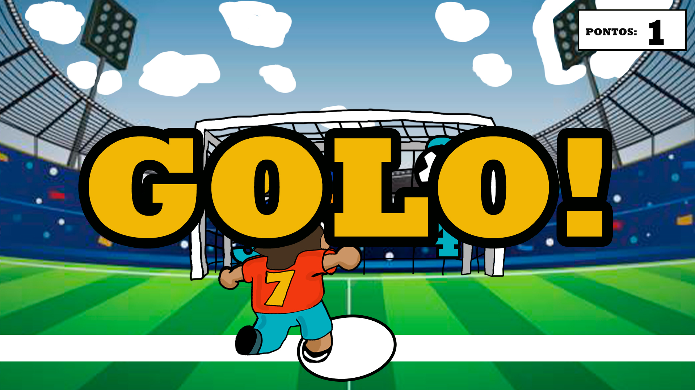
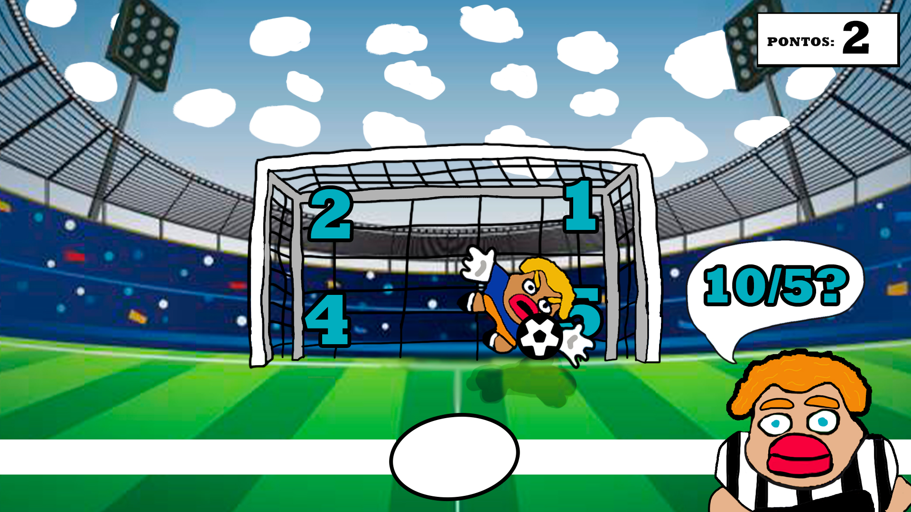
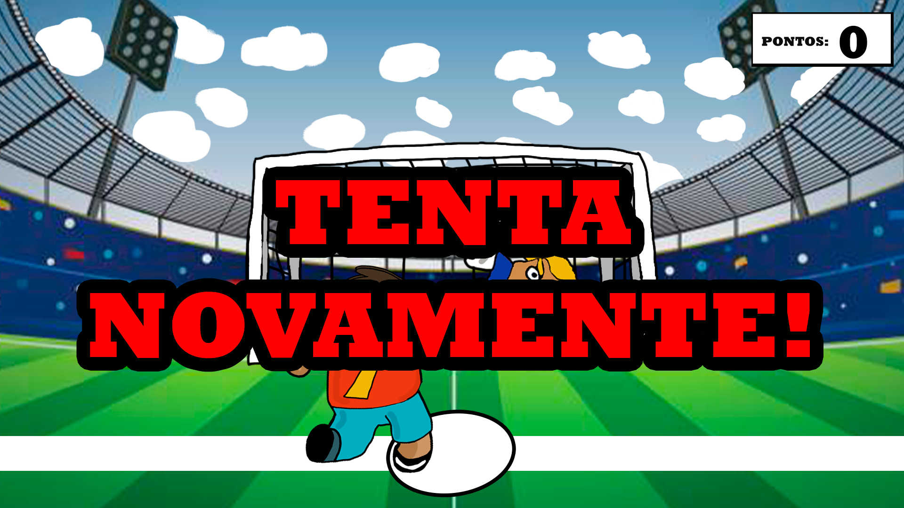

# JOGO FOOTQUIZ

## No que consiste o jogo?

Footquiz consiste em um jogo ONECLICK de penaltis para aprender matemática, é um jogo educacional para crianças do 1 ao 4 ano para se divertirem a aprender matemática com operações simples, o desafio é acumular mais pontos e bater seu próprio record.

# COMO JOGAR?

A jogabilidade é simples por ser um jogo Oneclick basta apenas clicar uma única vez que no caso seria na resposta certa ao clicar na resposta certa do número que está dentro da baliza o jogador irá bater o penalti e será golo acumulando então 1 ponto, caso o jogador erre a resposta o guarda redes irá defender a bola e o jogador poderá tentar novamente e assim vai dando continuidade ao jogo.

## Caso o jogador acerte

## Caso o jogador erre

https://www.youtube.com/watch?v=hVxXKPxg_rQ

Trabalho elaborado por Rui Machado e Pedro Pereira PME2
